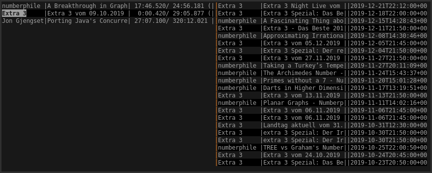

# uvp

uvp is mixed cli/tui podcatcher and player application intended to be used for
video feeds.

So far it has special support for youtube channels and queries of the German
public broadcasting multimedia library (via
[mediathekviewweb](https://mediathekviewweb.de/)), but other feeds can also be
added.  For video playback uvp uses [mpv](https://mpv.io) which therefore must
be installed on the system.  All persistent data is stored in an
[sqlite](https://sqlite.org/index.html)-database.

## Usage

All functionality of uvp is available via the command line interface.

```
$ uvp --help
uvp 0.1.0
ftilde <ftilde@protonmail.com>
A video-focused cmdline/tui podcatcher

USAGE:
    uvp <SUBCOMMAND>

FLAGS:
    -h, --help       Prints help information
    -V, --version    Prints version information

SUBCOMMANDS:
    add        Add a feed or video
    help       Prints this message or the help of the given subcommand(s)
    list       List feeds, available or active videos
    play       Play an (external) video
    refresh    Refresh the list of available videos
    remove     Remove an item from the list of available/active videos
    tui        Start an interactive tui for video selection
```

Additionally, a tui interface can be brought up using `uvp tui` which displays
an overview of active (left) and available (right) videos and can be used to
interactively select videos from either section for playing or removal.

### Screenshot


### Key bindings
* j/k/Up/Down: navigate the list.
* h/l/Left/Right: switch between active/available lists.
* Enter: Play the selected video
* d/Delete: Remove the selected video
* u: Undo deletion
* q: Quit

## Building

uvp is written in Rust and needs a working installation of cargo to build.

```
$ git clone https://github.com/ftilde/uvp
$ cd uvp
$ cargo build --release
$ target/release/uvp
```

Additionally, working installations of both sqlite and mpv are required.

## Configuration
uvp can be configured using a configuration file that can be placed in the
usual locations (`/etc` or `/usr/etc/`, users configuration directory). An
example configuration file can be found in this repository (`uvp.toml.sample`).

## Licensing

`uvp` is released under the MIT license.
